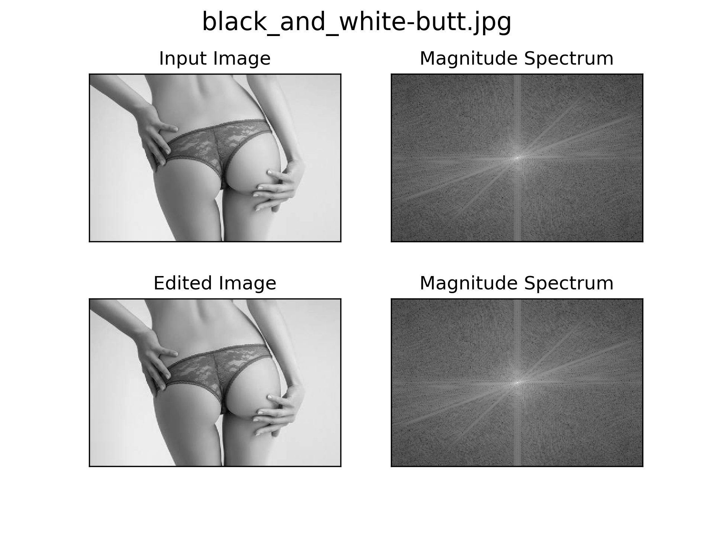
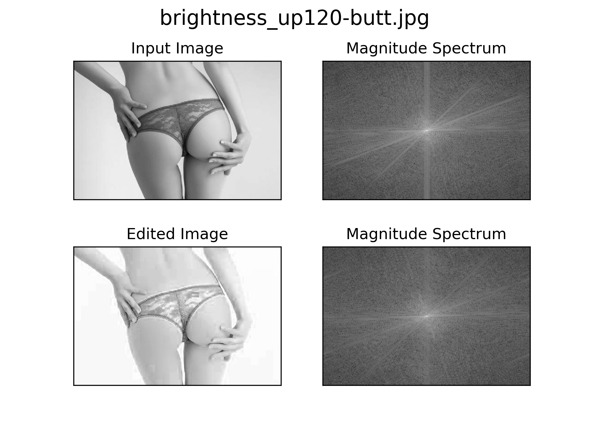
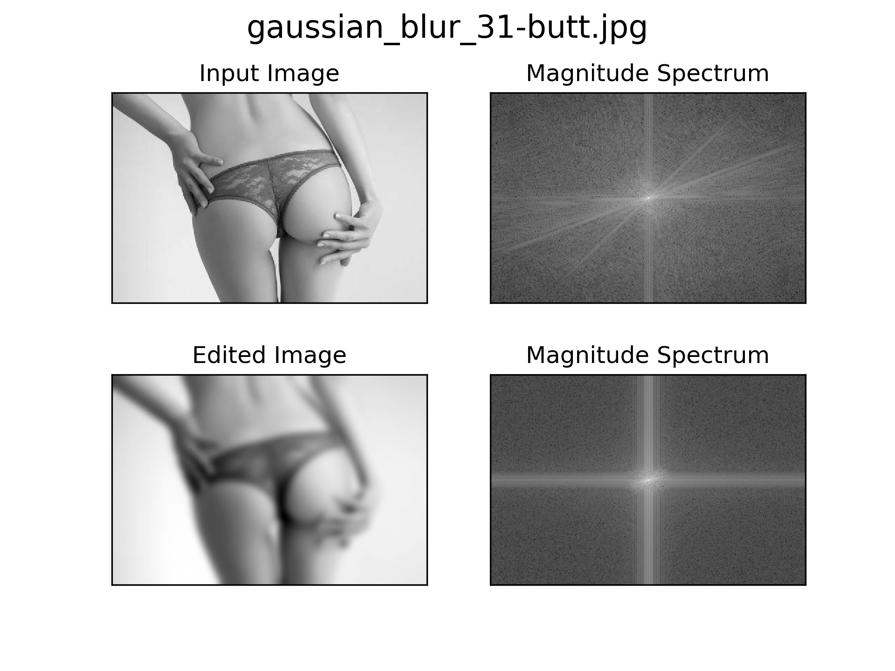

# Task 2: Fast Fourier Transform and a comparison on not-only monadic operations
In this task I created a small programe for transformation of images to their magnitude plane. This tranformation is called Fast Fourier Transformation and is widely used, especially in computer vision. FFT transforms information of frequencies from an image (entrophy) to a 2D plane. Lower frequencies, which hold more information are closer to the centre of the plane and higher frequencies are closer to the border.

## Shades of Grey
Almost no effect. However, trying FFT on single channels could bring pretty interesting outputs.

## Brightness +20 %
Only a small lose of information due to limitation of brightness value of a pixel at value 255. 

## Gaussian Noise (added in Photoshop by 30 %)
No evident pattern on the magnitude plane, brightened up, little stripes from up to bottom
## Negative
Has no effect. It is not surpsising. The information about patterns stays the same after invertation.

## Gaussian Blur
Removing details and texturing on the magnitude plane.

## Median blur
Adding significance on details on the magnitude plane.

## Noise Comparison
The magnitude plane is darker for Monochromatic Noise, thanks to less information in the noise (monochromatic noise has only of one color - grey). Gaussian noise is way brighter, but I can not explain why.

I wanted to know what FFT of diffferent noise would look like, so I made another test.

If we focus on the pictures above, we can see some stripes in the images. It could be information about the distribution of the noise, but it is only my hypothesis. Spaces between stripes of gaussian noise has same width. For noise with normal distribution, the spaces between stripes increases more from the center of FFT. This behaviour could be caused by logaritmic scale of FFT.

# Conslusion
As it was expected, only such transformations, that changes texture and patterns in the image, had significant impact on the magnitude plane of images. Personally I would like to know, why the gaussian blur is brighter than the other added noises. Also I would like to know if the stripes in FFT of gaussian and normal noise is the information about the distribution on the noise.